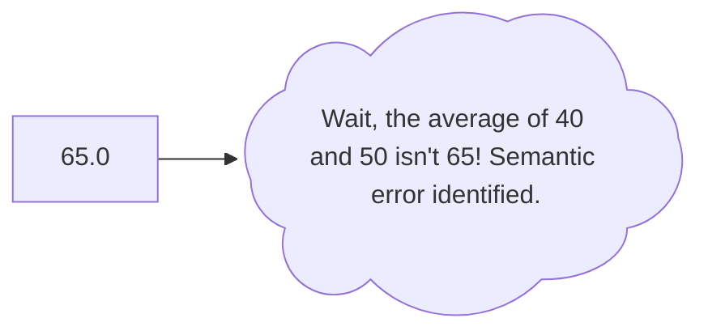

> ***“Syntax is learning how to draw the lines with your pen, while semantics is making sure those lines actually lead to the treasure.”***

## 1. 🗺️ Syntax vs. Semantics: The Cartographer's Guide

When you are exploring the vast plains of computer science, you need a way to communicate with the machine. But computers are brutally literal. To write code that actually works, you have to master two distinct concepts: ***Syntax*** and ***Semantics***.

If we think of programming like drawing a map, syntax is learning how to hold the pen, while semantics is making sure the map actually leads to the treasure.

---

### (a) 📐 Syntax: The Rules of the Road

> **🎯 Syntax is the grammar, spelling, and punctuation of a programming language.**

A computer doesn't "read between the lines." If your map's legend says that a triangle means a mountain, but you draw a slightly crooked triangle, the computer won't guess you meant a mountain. It will just throw an error and refuse to read the rest of the map.

In Python, syntax dictates things like:

* Using parentheses for a print() function.

* Making sure your indentation is perfectly aligned.

* Spelling variables the exact same way every time.

> [!NOTE]
> *When you break a syntax rule, your code will not run. The interpreter hits a wall, throws a ***SyntaxError***, and stops dead in its tracks.*

---

### (b) 🧭 Semantics: The Meaning of the Journey

> **🎯 Semantics is the actual logic and meaning behind your code.**

This is where things get tricky. Let's say your syntax is flawless. You drew the triangles perfectly. ***But...*** you placed the mountains in the middle of the ocean. *Grammatically*, your map is beautifully drawn. *Semantically*, it's absolute nonsense.

In programming, a semantic error *(also called a 'logic error')* happens when your code runs perfectly without crashing, but it gives you the wrong result.

The computer did exactly what you told it to do; you just told it to do the wrong thing.

---

### 💻 Theory Grounded in Practice

Let's look at how both of these concepts play out when we are processing a dataset, like a batch of patient records for a medical model.

**(i) 🚨 A Syntax Error (The grammar is broken)**

```python

patient_age = 45

# This will immediately crash because we forgot the closing parenthesis.
# The computer literally cannot parse what we are trying to say.
print("The patient is " + str(patient_age)

```

**Output:** 

```text

SyntaxError: unexpected EOF while parsing

```

**(ii) 🚨 A Semantic Error (The grammar is fine, but the logic is flawed)**

```python 

# Let's say we want to calculate the average age of two patients.
patient_one = 40
patient_two = 50

# Syntax is perfect here. It will run without crashing!
# BUT... because we forgot parentheses around the addition, Python divides patient_two by 2 first (Order of Operations).
average_age = patient_one + patient_two / 2

# Output will be 65.0 instead of 45.0. This is because according to the standard mathematics rule, division operation occurs first and after that addition operation occurs and is assigned to 'average_age' variable.

# This is a semantic error—a beautiful map that leads to the wrong destination.
print(average_age) 

```

**Output:**

```text

65.0 

```



---

### 💡 Summary (The Explorer's Takeaway):

You will fix syntax errors in seconds because the computer tells you exactly where you messed up. You will spend hours fixing semantic errors because the computer thinks everything is fine.<br> 
***Master the syntax so you can focus your mental energy on the semantics.***

<br>

---

## 2. 🗺️ The Legend of the Map: Python's Syntax rules

Every map has a legend: a strict set of symbols and guidelines that define how it must be drawn. In the Python territory, the legend is famous for being incredibly clean. Unlike the dense, punctuation-heavy forests of C or Java, Python uses the white space of the page itself to guide the way.

---

### 📏 Rule 1: Indentation is the Law (The Topography of Code)

In languages like *'C'* or *'Java'*, curly braces `{}` define where a block of code starts and ends. You could theoretically write an entire C program on a single line. Python completely **rejects** this. 

Python uses **whitespace (indentation)** to define scope. If your indentation is off by even one space, the map is broken and Python will throw an **`IndentationError`**.

```python

# ✅ The Right Way: Consistent 4 spaces (or 1 tab) for the block
if True:
    print("We are inside the block.")
    print("Still inside the block.")

# ❌ The Wrong Way: Misaligned whitespace will crash the program
if True:
    print("We are inside the block.")
   print("Wait, where am I?") # This line triggers a fatal error!

```

**Output:** 

```text

    IndentationError: unindent does not match any outer indentation level

```

---

<details markdown = "1">

<summary><b> 💡 NOTE: How Python works under the hood when analyzing a piece of code </b></summary>

---

### 🔍 The Two Phases of Python
*Before Python executes a single command, it actually processes your file in two distinct steps. Think of it like a master cartographer inspecting a map before allowing anyone to use it for a journey.*

* **Phase 1: The Syntax Sweep (Compilation)**

Python reads your entire file from top to bottom just to check the grammar. It isn't trying to run the code yet; it is simply verifying that every single line obeys the strict laws of Python syntax. If the entire file passes the check, Python translates it into a lower-level language called "bytecode."

* **Phase 2: The Journey (Execution)**

Only *after* the entire file successfully passes Phase 1 does the Python Virtual Machine actually start running the code, executing variables, and printing things to your screen.

---

### 🚨 Why your above code sank before leaving the Dock?

**An `IndentationError` is a fatal Syntax Error.**
During Phase 1, Python was sweeping your file. It saw lines 3-5 and said, "Looks good." Then it hit line 10, saw the broken indentation, and threw its hands up. Because the file contained an illegal grammar structure, the compilation failed immediately. Python completely refused to generate the bytecode. Because Phase 1 failed, Phase 2 never even started. That is why your perfectly written code at the top was completely ignored.

---

### 🧠 The Semantic Exception (When the top would print)

However, if line 10 had a Semantic Error or a Runtime Error—for example, if the indentation was perfect, but you tried to divide a number by zero (`print(10 / 0)`)—things would happen differently.

* The syntax check (Phase 1) would pass because dividing by zero is grammatically legal.

* Execution (Phase 2) would begin.

* The top block would successfully print to your terminal.

* The program would then crash when it reached the mathematical impossibility on line 10.

*But because whitespace is a strict law of the land in Python, a single misplaced space breaks the entire map before the journey even begins!*

</details>

---

### 📏 Rule 2: Case Sensitivity (Precise Coordinates)

Python is strictly case-sensitive. When naming your variables (the landmarks on your map), an uppercase letter completely changes the destination.

```python

# These are two completely distinct variables occupying different space in memory.
altitude = 1000
Altitude = 5000

print(altitude) # Outputs: 1000

print(Altitude) # Outputs: 5000

```

---

### 📏 Rule 3: The Cartographer's Notes (Comments)

You need to leave notes for other explorers (and for yourself when you look at this code 6 months from now).

* Use a single hash # for quick, one-line notes.

* Use triple quotes """ for multi-line explanations (docstrings).

```python

# This is a standard single-line comment.

"""
This is a multi-line comment.
We use this for detailed explanations, 
often placed at the very top of a complex script or function.
"""

'''
This is aother format of a multi-line comment.
We use this for detailed explanations, 
often placed at the very top of a complex script or function.
'''

```

---

### 📏 Rule 4: Dynamic Typing (Naming the Landmarks)

You do not need to tell Python what *type* of data a variable holds. You don't need **int**, **float**, or **char**. You simply point to the data, and Python's engine figures out the rest on the fly.


> [!NOTE]
> *You also don't need a semicolon `;` at the end of your lines. A simple line break is all Python needs to know the statement is finished.*


```python

# How we did it in C:
# int patient_age = 45;

# How we do it in Python:
patient_age = 45        # Python automatically knows this is an integer
patient_name = "John"   # Python automatically knows this is a string

```

---

### 📏 Rule 5: Line Continuation (Extending the Map)

Sometimes a line of code gets too long and runs off the edge of the screen. You can break it across multiple lines cleanly using a backslash \, or by wrapping it in parentheses ().

```python

# Using a backslash to keep the map readable
total_distance = distance_to_first_node + \
                 distance_to_second_node + \
                 distance_to_final_node

# Using parentheses (often preferred for cleanliness)
total_distance = (distance_to_first_node + 
                  distance_to_second_node + 
                  distance_to_final_node)

```

---

<details markdown = "1">

<summary> <b>🧩 The Explorer's Challenge: Question of the Day </b> </summary>

---
  
**The Scenario:**
You are mapping out the coordinates for your next expedition. You wrote the following Python script to calculate the exact center point between three landmarks, but the map is leading you straight into a swamp! 

There are **two** critical errors in this code: one **Syntax Error** and one **Semantic Error**. 

Can you spot both of them before opening the solution?

```python
landmark_x = 10
landmark_y = 20
landmark_z = 30

# Calculate the average distance to find the center
center_point = landmark_x + landmark_y + landmark_z / 3

 print("The center is: ", center_point)

```

<details markdown = "1">

<summary> <b> 🧩 The Explorer's Challenge: Solution </b> </summary>

---
  
**1. The Syntax Error (The Grammar)**

Look closely at the print statement on the last line. It has a single extra space at the beginning! Because Python relies purely on whitespace, this triggers an **'IndentationError'**. The code will instantly crash during Phase 1 *(The Syntax Sweep)* before it even tries to do the math.

**2. The Semantic Error (The Logic)**

Once you delete that space, the code runs beautifully... but gives you the wrong destination. Because of the mathematical order of operations **( PEMDAS [*P: 'Parentheses', E: 'Exponent', M: 'Multiplication', D: 'Division', A: 'Addition', S: 'Subtraction'*] )**, Python divides landmark_z by `3` first, and then adds the other two. It calculates `10 + 20 + 10 = 40`, instead of the true average which is `20`.

**The Corrected Code:**

```python

landmark_x = 10
landmark_y = 20
landmark_z = 30

# Using parentheses fixes the Semantic Error (Logic)
center_point = (landmark_x + landmark_y + landmark_z) / 3

# Removing the rogue space fixes the Syntax Error (Grammar)
print("The center is: ", center_point)

```  
  
</details>
  
</details>

---
